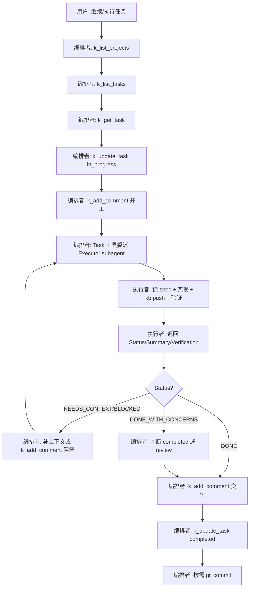

# Agent 协作 SOP

Task Banner 作为**任务源**，Cursor Agent 通过 **TaskBanner MCP** 拉取任务并执行，**kooboo-cli-coding** skill 指导代码实现。本文是 Agent 的标准作业流程（SOP）。

## 1. 角色与边界

| 角色 | 职责 |
| --- | --- |
| **人（你）** | 在 Task Banner 创建/编辑任务、验收、合并 PR、决定是否 push |
| **Task Banner** | 任务状态、描述、评论、附件的唯一事实来源 |
| **编排者 Orchestrator** | MCP 拉任务 / 开工 / 完工回写；**委派**执行者；汇总给用户 |
| **执行者 Executor（subagent）** | 读任务包 → 实现代码 → 验证 → 返回结构化报告；**不碰 MCP** |

**Cursor skill 对应**

| 角色 | Skill 路径 |
| --- | --- |
| 编排者 | `.cursor/skills/task-banner-orchestrator/SKILL.md` |
| 执行者 | `.cursor/skills/task-banner-executor/SKILL.md` |
| 委派模板 | `.cursor/skills/task-banner-orchestrator/executor-prompt.md` |

**原则**

- 任务内容以 Task Banner 为准，聊天里的口头补充次之。
- 代码改动走本地 `task-banner` 仓库 + `kb push`，不走 Kooboo AI Chat 对象 API。
- 未验证前不得标记 `completed`；未获确认不得 `git push` 远程。
- **编排者不直接写业务代码**（SOP/文档类任务除外）；实现一律委派 subagent。

## 2. 触发语与默认动作

用户说以下任一表述时，**先走 MCP 拉任务**，再执行：

| 用户意图 | Agent 默认动作 |
| --- | --- |
| 「查看任务 / 继续任务 / 完成任务」 | `k_list_projects` → `k_list_tasks`（筛 `todo`/`in_progress`） |
| 「执行 #1006 / 做这个任务」 | `k_get_task` → 开工流程 |
| 「提交 commit」 | 仅 git commit，不 push |
| 「不用 push」 | 只做本地 commit + `kb push` 远端 Kooboo（若需要） |

## 3. 端到端流程（编排者 + 执行者）



### 3.1 编排者 checklist

- [ ] MCP 拉取最新任务（非聊天记忆）
- [ ] `in_progress` + 开工评论
- [ ] 用 `executor-prompt.md` 填完整任务包再委派
- [ ] 收到 subagent 报告后再回写 Task Banner
- [ ] 不向用户宣称完成，除非 subagent Status=DONE 且编排者已回写

### 3.2 执行者 checklist

见 `.cursor/skills/task-banner-executor/SKILL.md`

## 4. MCP 调用规范

### 4.1 工具名

远端工具带 `k_` 前缀，例如 `k_list_tasks`、`k_add_comment`。

### 4.2 推荐调用顺序

```text
1. k_list_projects          → 取 project_id（通常 task-banner 项目）
2. k_list_tasks             → 列待办；参数 status=todo 或不过滤后本地筛
3. k_get_task               → 读 title / content / status / progress
4. k_update_task            → 开工 in_progress；完工 completed
5. k_add_comment            → 计划、进度、交付说明（type 默认 ai_completion）
6. k_create_task            → 仅当需要拆分子任务或记录 follow-up
```

### 4.3 任务状态机

| 状态 | 含义 | Agent 动作 |
| --- | --- | --- |
| `todo` | 待处理 | 可被领取 |
| `in_progress` | 进行中 | 领取后立即设置 |
| `review` | 待验收 | 实现完成、需人看代码/UI 时使用 |
| `completed` | 已完成 | 验证通过后设置 `progress: 100` |

**领取任务时至少更新：**

```json
{
  "task_id": "...",
  "status": "in_progress",
  "summary": "Agent 已领取，开始实现"
}
```

**完成任务时至少更新：**

```json
{
  "task_id": "...",
  "status": "completed",
  "progress": 100,
  "summary": "一句话交付摘要"
}
```

### 4.4 评论模板（`k_add_comment`）

**开工**

```markdown
## 开工

**理解**：…
**计划**：
1. …
2. …
**验收标准**：…
```

**阻塞**

```markdown
## 阻塞

**现象**：…
**已尝试**：…
**需要人工**：…
```

**交付**

```markdown
## 交付

**改动**：…
**验证**：…（命令 / 截图 / MCP 测试结果）
**Git**：commit `<hash>`（若有）
**后续**：…（可选 follow-up）
```

## 5. 任务描述写作规范（给人）

写好任务 = Agent 少猜、少返工。创建任务时建议包含：

### 5.1 必填块

可直接复制模板：`.kooboo-ai/templates/task-for-agent.md`

```markdown
## 背景
为什么要做

## 目标
完成后用户能做什么

## 验收标准
- [ ] 可观测结果 1
- [ ] 可观测结果 2

## 范围
- 做：…
- 不做：…
```

### 5.2 可选但强烈建议

| 块 | 说明 |
| --- | --- |
| **相关文件** | `src/api/xxx.ts`、`frontend/src/views/YYY.vue` |
| **参考** | 类似功能、设计稿、Issue 链接 |
| **测试方式** | 命令、页面路径、API 示例 |
| **优先级理由** | 为何 urgent / high |

### 5.3 图片与附件

- **图片放附件**时：Agent 需通过 HTTP `GET /api/attachment/list?relatedType=task&relatedId={task_id}` 读取（MCP `k_get_task` **不含**附件）。
- **图片嵌在 Markdown 描述**中：Agent 可直接读 `content`。
- 若任务依赖看图，请在描述里写一句：「见附件 xxx」或直接用 Markdown 图片语法。

## 6. 执行阶段（执行者 subagent + kooboo-cli-coding）

**编排者不执行本节**；委派后由 **task-banner-executor** 完成。

领取任务包后，执行者按以下顺序读文档：

```text
.kooboo-ai/README.md
.kooboo-ai/specs/agent-sop.md   ← 本文件
.kooboo-ai/specs/mcp.md
.kooboo-ai/rules/overrides.md
按需: frontend.md / backend.md / routing.md
kooboo-cli-coding skill → references/*（按任务类型）
```

### 6.1 任务类型 → 动作

| 任务类型 | 关键步骤 |
| --- | --- |
| 后端 API | 改 `src/code/Services/*` + `src/api/*` → `kb push src/api/...` |
| MCP 工具 | 改 `mcp-tools/*.ts` → `kb push mcp-tools/...` |
| 前端页面 | 改 `frontend/src/*` → `pnpm build` → 或 `pnpm build:push` |
| 全栈 | 先后端 push，再 `pnpm build:push` |

### 6.2 同步策略

```bash
# 日常监听（人本地开发）
pnpm dev

# Agent 窄范围推送（优先）
kb push src/api/task.ts
kb push mcp-tools/add_comment.ts
kb push --git --unstaged    # 推送 git 工作区内的资源变更

# 前端
pnpm build
kb push src/page/index.html
kb push src/js/index.js    # 稳定文件名，manifest 内列出的 chunk 按需 push

# 或一键 build + push
pnpm build:push

# Agent HTTP 回写（MCP 不可用时）：评论 type=ai_completion + 更新 aiNotify=true 也会写入消息通知
```

### 6.3 验证清单（交付前）

- [ ] 改动与任务**验收标准**逐条对应
- [ ] 后端：`kb push` 成功
- [ ] 前端：build 无 type-check 错误
- [ ] 能跑的实际命令已跑（curl / MCP / 单测）
- [ ] 未引入 `.env` 密钥、未误用 Kooboo Chat API
- [ ] Task Banner 已 `k_add_comment` + `k_update_task completed`

## 7. Git 策略

| 动作 | 规则 |
| --- | --- |
| `git commit` | 用户明确要求，或完成一个可交付单元后询问 |
| `git push` | **必须**用户二次确认 |
| commit message | 与任务标题/交付摘要一致，说明「为什么」 |

## 8. 反模式（禁止）

| 反模式 | 正确做法 |
| --- | --- |
| 只看聊天不看 Task Banner | 先 MCP 拉最新任务与评论 |
| 未验证就 `completed` | 先跑验证，再更新状态 |
| 用 Bearer 头判断 MCP（API 层） | MCP 通知只在 `mcp-tools/*` 里发 |
| 直接改 `src/js/` 产物 | 只改 `frontend/src`，再 build |
| 一次 push 整个仓库无必要 | 窄范围 `kb push` |
| 任务描述含糊仍硬做 | `k_add_comment` 问清阻塞，或置 `review` |

## 9. MCP 能力缺口（已知）

以下能力**尚未**暴露 MCP，Agent 需用 HTTP API 或让人补工具：

| 需求 | 当前替代 |
| --- | --- |
| 任务附件 / 图片 | `GET /api/attachment/list?relatedType=task&relatedId=` |
| 评论历史 | `GET /api/task/comments?taskId=` |
| 活动流 | `GET /api/task/activities?taskId=` |
| 删除任务 | 暂无 MCP；测试任务可 `completed` 归档 |

后续可增 MCP：`list_comments`、`list_attachments`、`delete_task`。

## 10. 会话快捷指令（给人）

```text
按 task-banner-orchestrator：MCP 拉 todo 任务，委派 executor subagent 实现，你只做状态回写；不要 push 远程。
```

```text
查看 task-banner 未完成任务并建议执行顺序（编排者角色，暂不委派）。
```

```text
执行任务 #<displayId>：编排者拉任务 → 委派 subagent → 完工回写 Task Banner。
```

## 11. 示例：一次完整协作

1. 人创建任务「新增 account 页面」，验收标准两条。
2. 人说「继续完成任务」。
3. Agent：`k_list_tasks` → 选中 #1006 → `k_get_task` → `k_update_task(in_progress)`。
4. Agent 读 `backend.md` + `frontend.md`，实现 API 与 `Account.vue`。
5. Agent：`kb push` + `pnpm build` + push 静态资源。
6. Agent：`k_add_comment` 交付说明 → `k_update_task(completed)`。
7. 人验收；若 OK，说「提交 commit」→ Agent 本地 commit，不 push。

---

**维护**：MCP 工具增删、流程变更时同步更新本文件与 `specs/mcp.md`。
